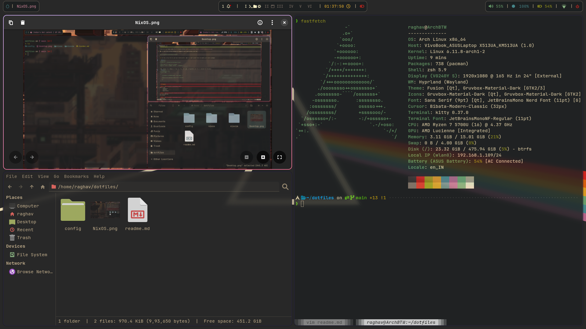

### NixOS config
[WIP] Config for my NixOS system, will update as I explore more

## Plasma Configs

## ZSH Configs
- For the shell itself, using [Oh-My-ZSH](https://github.com/ohmyzsh/ohmyzsh) and [Starship](https://github.com/starship/starship)
- Some cool tools:
	- [LSD](https://github.com/lsd-rs/lsd)
	- [Micro](https://github.com/zyedidia/micro)

### Plasma Widgets: 
- [Compact Pager](https://github.com/dhruv8sh/plasma6-desktop-indicator)
- [Panel Spacer Extended](https://github.com/luisbocanegra/plasma-panel-spacer-extended)
- [Plasma Panel Colorizer](https://github.com/luisbocanegra/plasma-panel-colorizer)
- [Application Title Bar](https://github.com/antroids/application-title-bar)
- [Plasma6 Window Title Applet](https://github.com/dhruv8sh/plasma6-window-title-applet)
- [KDE Rounded Corners](https://github.com/matinlotfali/KDE-Rounded-Corners)

Hyprland Setup

---
Old KDE Plasma 6 setup

Thanks to @XNM1's [hyprlock config](https://github.com/XNM1/linux-nixos-hyprland-config-dotfiles/)

And even bigger thanks to @JaKooLit's amazing [dotfiles](https://github.com/JaKooLit/Hyprland-Dots/)
